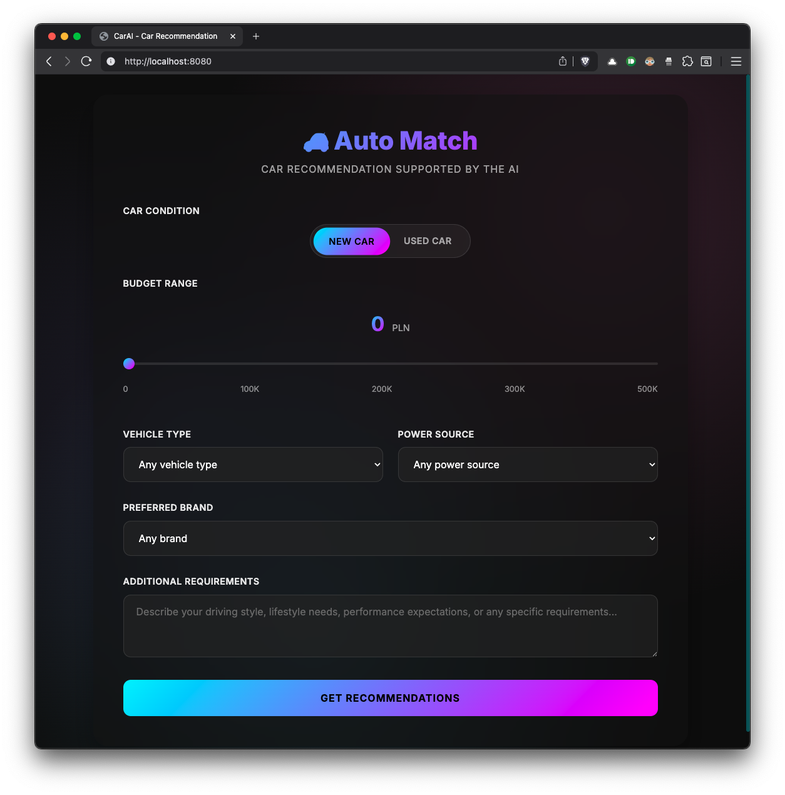

## car recommendation AI

This is sample car recommendation app built with Spring AI and Open AI.

## configuration

configure OpenAI API key and model in the `src/main/resources/application.properties` file:

```
spring.ai.openai.api-key={YOUR_KEY}
spring.ai.openai.chat.options.model=gpt-4o-mini
```

## building the project

```
./gradlew clean bootJar
```

## running the project

```
java -jar builds/lib/*.jar
```

## frontend

frontend is just a single HTML file vibe coded with Claude including JS and CSS

open `http://localhost:8080` in the browser


